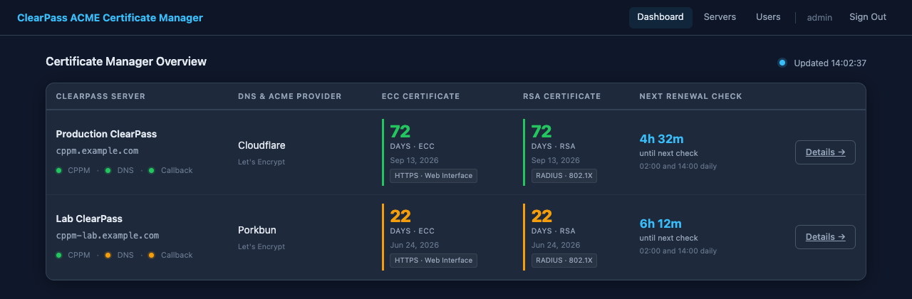
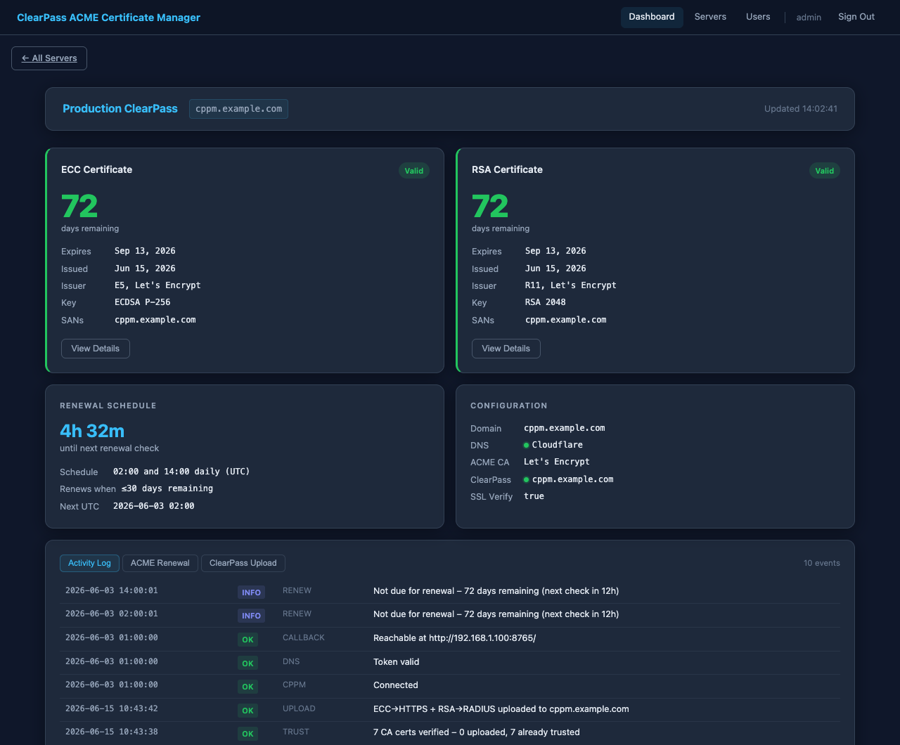
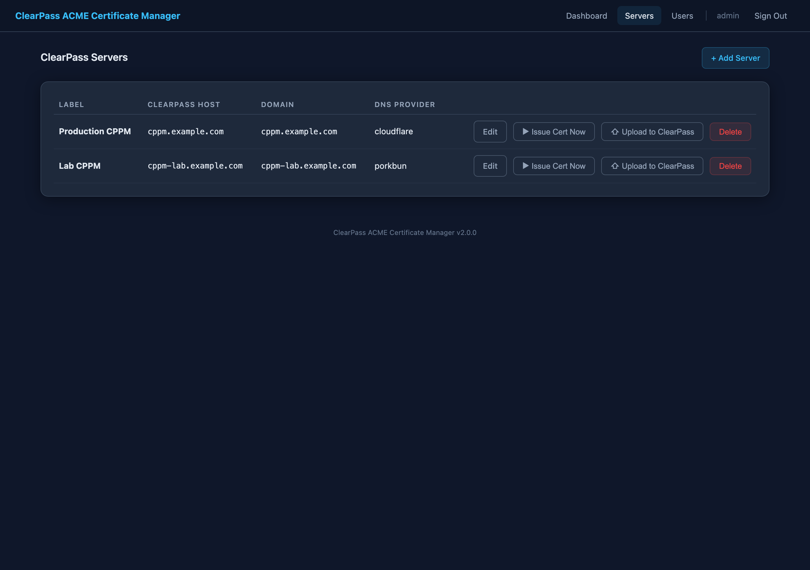

# ClearPass ACME Certificate Manager

[](LICENSE)

Automated TLS certificate issuance and renewal for **Aruba ClearPass Policy Manager (CPPM)**
using [acme.sh](https://github.com/acmesh-official/acme.sh) and a DNS-01 challenge.
Everything runs in a self-contained Alpine Linux Docker container with persistent storage
on the host.

Two certificates are issued and maintained simultaneously:

| Certificate | Algorithm | CPPM Service | Purpose |
|---|---|---|---|
| ECC (P-256) | ECDSA | HTTPS(ECC) | Web UI and API access |
| RSA (2048) | RSA | RADIUS | 802.1X / EAP authentication |

```
┌──────────────────────────────────────────────────────────────────────────┐
│              ClearPass ACME Certificate Manager Flow                     │
│                                                                          │
│  ┌──────────────┐  DNS-01  ┌─────────────────┐                          │
│  │   acme.sh    │◄────────►│  DNS Provider   │                          │
│  │  (supercronic│          │  (Cloudflare,   │                          │
│  │   2x daily)  │          │   Porkbun, etc) │                          │
│  └──────┬───────┘          └─────────────────┘                          │
│         │ ECC + RSA certs issued/renewed                                 │
│         ▼                                                                │
│  ┌──────────────┐  PKCS12 + REST API  ┌──────────────────────────────┐  │
│  │ deploy_hook  │────────────────────►│  clearpass_upload.py         │  │
│  │    .sh       │                     │  (pyclearpass SDK)            │  │
│  └──────────────┘                     │                              │  │
│                                       │  Step 0: LE Trust List       │  │
│                                       │  Step 1: PUT HTTPS(ECC) cert │  │
│                                       │  Step 2: PUT RADIUS(RSA) cert│  │
│                                       │  Step 3: Verify              │  │
│                                       └──────────────┬───────────────┘  │
│                                                      │                  │
│                                              ┌───────▼──────┐           │
│                                              │     CPPM     │           │
│                                              │  HTTPS(ECC)  │           │
│                                              │  RADIUS(RSA) │           │
│                                              └──────────────┘           │
│                                                                          │
│  Persistent storage: /opt/cppm-certs (host) ◄──── /data/certs (container) │
└──────────────────────────────────────────────────────────────────────────┘
```

---

## Table of Contents

1. [Prerequisites](#prerequisites)
2. [DNS Provider Support](#dns-provider-support)
3. [Directory Structure](#directory-structure)
4. [Initial Setup](#initial-setup)
5. [How It Works](#how-it-works)
6. [Certificate Files](#certificate-files)
7. [Web UI](#web-ui)
8. [Verifying the Certificates in CPPM](#verifying-the-certificates-in-cppm)
9. [Maintenance](#maintenance)
10. [Troubleshooting](#troubleshooting)
11. [Security Considerations](#security-considerations)
12. [ClearPass API Reference](#clearpass-api-reference)

---

## Prerequisites

| Requirement | Notes |
|---|---|
| Docker Engine ≥ 24.x | With Compose v2 plugin (`docker compose`) |
| Host OS | Any Linux with Docker support (Ubuntu 22.04 LTS recommended) |
| DNS provider | Domain managed by a supported DNS provider (see below) |
| CPPM version | 6.9.x through 6.12.x (confirmed on 6.11.13) |
| Network | Container needs outbound HTTPS to your DNS provider API and CPPM |
| LAN IP | A host IP that CPPM can route to (required for cert upload callback) |

---

## DNS Provider Support

The ACME DNS-01 challenge is used for certificate issuance. Select the provider
and enter credentials when adding or editing a server in the web UI
(**Servers → Add Server / Edit**) or via `cppm-servers add`.

| Provider | Selector value | Credentials required |
|---|---|---|
| Cloudflare *(default)* | `cloudflare` | API Token + Zone ID (or Global Key + Email) |
| Porkbun | `porkbun` | `PORKBUN_API_KEY` + `PORKBUN_SECRET_API_KEY` |
| AWS Route 53 | `route53` | `AWS_ACCESS_KEY_ID` + `AWS_SECRET_ACCESS_KEY` |
| DigitalOcean | `digitalocean` | `DO_API_KEY` |
| GoDaddy | `godaddy` | `GD_Key` + `GD_Secret` |
---

## Directory Structure

```
cppm-acme-cert-manager/
├── Dockerfile                  # Alpine + acme.sh + Python image
├── docker-compose.yml          # Service definition, volume and port mapping
├── env-example                 # Safe-to-commit reference — copy to .env
├── setup.sh                    # One-time host preparation script
├── config/
│   └── crontab                 # Renewal schedule (supercronic, inside container)
├── scripts/
│   ├── entrypoint.sh           # Startup: validates env, manages cert state, starts supercronic
│   ├── issue_cert.sh           # Issues ECC + RSA certs via DNS-01
│   ├── install_cert.sh         # Copies flat files from acme.sh state to /data/certs/
│   ├── renew.sh                # Called by supercronic — runs acme.sh --renew
│   ├── deploy_hook.sh          # Called after issuance/renewal — triggers CPPM upload
│   ├── clearpass_upload.py     # Uploads certs to CPPM via pyclearpass SDK
│   ├── trust_check.sh          # Weekly trust list verification (supercronic, Sunday 03:00)
│   ├── status_server.py        # Web UI and REST API (port STATUS_PORT)
│   ├── config_utils.py         # ClearPass server config CRUD (/data/certs/servers.json)
│   ├── auth_utils.py           # Session tokens, bcrypt credential storage
│   ├── cppm_acme_manager_servers.py  # CLI: manage ClearPass server entries
│   ├── cppm_acme_manager_users.py    # CLI: manage admin user accounts
│   └── status.sh               # Shared status logging library
├── acme-ca-certs/
│   └── trust-exclusions.conf   # Default exclusion list for trust list uploads (admin-editable)
└── docs/
    ├── 01-initial-setup.md
    ├── 02-how-it-works.md
    ├── 03-monitoring.md
    ├── 04-maintenance.md
    ├── 05-troubleshooting.md
    ├── 06-script-reference.md
    └── 07-quick-reference.md
```

**Host persistent storage (survives container rebuilds):**

```
/opt/cppm-certs/                              ← bind-mounted to /data/certs in container
├── status.log                                ← one-line-per-event summary log
├── servers.json                              ← ClearPass server configs (chmod 600)
├── admin.htpasswd                            ← web UI admin credentials (bcrypt, chmod 600)
├── .session-secret                           ← HMAC session signing key (chmod 600)
├── <domain>.ecc.cer                          ← ECC domain cert (PEM)
├── <domain>.ecc.key                          ← ECC private key (chmod 600)
├── <domain>.ecc.fullchain.cer                ← ECC cert + intermediates
├── <domain>.ecc.ca.cer                       ← ECC CA chain
├── <domain>.rsa.cer                          ← RSA domain cert (PEM)
├── <domain>.rsa.key                          ← RSA private key (chmod 600)
├── <domain>.rsa.fullchain.cer                ← RSA cert + intermediates
├── <domain>.rsa.ca.cer                       ← RSA CA chain
├── <domain>_ecc/                             ← acme.sh ECC internal state
├── <domain>/                                 ← acme.sh RSA internal state
├── .acme-state/                              ← acme.sh config and account keys
├── trust-exclusions.conf                     ← CA cert upload exclusion list (admin-editable)
└── .logs/
    ├── startup.log
    ├── renewal.log
    ├── upload.log
    ├── cron.log
    └── status_server.log
```

---

## Initial Setup

### 1. Host preparation

```bash
cd /opt/cppm-acme-cert-manager
chmod +x setup.sh && ./setup.sh
```

`setup.sh` verifies Docker, creates `/opt/cppm-certs`, and copies `env-example`
to `.env` if it does not already exist.

### 2. Configure `.env`

`.env` controls **container-level behaviour only** — ports, timezone, and
operational flags. ClearPass credentials, DNS provider, domain, and ACME
settings are configured through the web UI after the container starts.

```bash
nano .env
```

```ini
TZ=America/New_York          # container timezone for logs and cron
STATUS_PORT=8080             # web UI port (must match docker-compose.yml)
CPPM_CALLBACK_PORT=8765      # PKCS12 delivery port (must match docker-compose.yml)
REQUIRE_AUTH_FOR_STATUS=false
```

```bash
chmod 600 .env
```

### 3. Create the ClearPass API client

1. CPPM Admin UI → **Administration → API Services → API Clients → Add**
2. Configure:

   | Field | Value |
   |---|---|
   | Client ID | `cppm-acme-cert-manager` |
   | Enabled | ✓ |
   | Operator Profile | `Super Administrator` or custom (see note) |
   | Grant Types | `client_credentials` |
   | Access Token Lifetime | `28800` (8 hours) |

3. Click **Create Client** and copy the client secret — shown only once.

> **Minimum custom Operator Profile permissions:**
> Administration → Operator Logins → Operator Profiles → Add
> Enable **Allow → All → Certificate Management**

### 4. Build and start

```bash
docker compose build --no-cache
docker compose up -d
docker compose logs -f
```

On first start with no servers configured the container logs a warning and
waits — this is expected:

```
[WARN ] No servers configured.
[WARN ]   Add one via the web UI after startup: http://<host>:8080/settings
[INFO ] Starting status web server on port 8080
[INFO ] Startup complete
```

### 5. Create the admin account

**Web UI:**

1. Open `http://<docker-host>:8080/` in a browser.
2. Click **Setup** in the navigation bar (visible only before any users exist).
3. Enter a username and a password of at least 8 characters.
4. Click **Create Admin Account** and sign in.

**CLI:**

```bash
docker exec -it cppm-acme-cert-manager cppm-users add admin
```

### 6. Add your ClearPass server

All per-server configuration — ClearPass host, API credentials, DNS provider,
domain, and ACME settings — is entered here and stored in `servers.json`.

#### Web UI method

1. Navigate to **Servers → + Add Server**.
2. Fill in all sections and click **Add Server**.

| Section | Fields |
|---|---|
| **Identity** | Friendly label (e.g. `Production ClearPass`) |
| **ClearPass** | Host/IP, Client ID, Client Secret, Cert Passphrase, Callback Host, Callback Port, Verify SSL |
| **Domain & ACME** | Domain, ACME email, Certificate Authority |
| **DNS Provider** | Provider selector + credentials (see table below) |

#### CLI method

```bash
docker exec -it cppm-acme-cert-manager cppm-servers add
```

Interactive prompts walk through the same fields. Secret values are entered
with `getpass` (not echoed).

#### DNS provider credentials

| Provider | Credentials needed |
|---|---|
| **Cloudflare** | API Token + Zone ID — create at [dash.cloudflare.com/profile/api-tokens](https://dash.cloudflare.com/profile/api-tokens) with `Zone:DNS:Edit` on the target zone |
| **Porkbun** | API Key + Secret API Key — enable API access per-domain at [porkbun.com/account/api](https://porkbun.com/account/api) |
| **AWS Route 53** | Access Key ID + Secret Access Key — IAM policy needs `route53:ChangeResourceRecordSets`, `ListHostedZones`, `GetChange`, `ListResourceRecordSets` |
| **DigitalOcean** | API Token with Write scope — generate at [cloud.digitalocean.com/account/api/tokens](https://cloud.digitalocean.com/account/api/tokens) |
| **GoDaddy** | API Key + API Secret — create at [developer.godaddy.com/keys](https://developer.godaddy.com/keys) |

> **Callback Host:** set this to the Docker host's LAN IP that ClearPass can
> route to — not the container IP. Find it with:
> ```bash
> ip route get <cppm-ip>   # look for 'src X.X.X.X'
> ```

### 7. Trigger first-run certificate issuance

After saving the first server, restart the container so it picks up the new
configuration and issues the certificates:

```bash
docker compose restart
docker compose logs -f
```

Expected first-run sequence:

```
[INFO ] No certificates found – starting first-time issuance
[ISSUE] Issuing ECC (ec-256) certificate via <provider> DNS-01
[ISSUE] Issuing RSA (2048) certificate via <provider> DNS-01
[OK   ] New certificates issued (ECC + RSA)
[OK   ] ECC+RSA certs installed – expires <date>
[OK   ] CA certs verified – uploaded to trust list
[OK   ] ECC→HTTPS + RSA→RADIUS uploaded to cppm.example.com
[INFO ] supercronic started – renewal checks at 02:00 and 14:00 UTC
```

First-run time: 2–5 minutes (DNS propagation for the ACME challenge).

---

## How It Works

### Certificate issuance (first run)

```
entrypoint.sh
    └── issue_cert.sh
            ├── acme.sh --issue --keylength ec-256   ECC via DNS-01
            ├── acme.sh --issue --keylength 2048      RSA via DNS-01
            └── install_cert.sh
                    ├── acme.sh --install-cert --ecc  → <domain>.ecc.*
                    ├── acme.sh --install-cert        → <domain>.rsa.*
                    └── deploy_hook.sh
                            └── clearpass_upload.py  (pyclearpass SDK)
                                    ├── Step 0: Trust List Pre-flight
                                    │     Compute SHA-256 fingerprints from cert_file
                                    │     PEM in each trust list entry, then:
                                    │     POST  /api/cert-trust-list  (missing certs)
                                    │     PATCH /api/cert-trust-list/{id}  (wrong flags)
                                    │     cert_usage: ["EAP", "Others"]
                                    │
                                    ├── Step 1: ECC → HTTPS(ECC)
                                    │     GET  /api/cluster/server/publisher  (UUID)
                                    │     GET  /api/server-cert  (find HTTPS(ECC) slot)
                                    │     PUT  /api/server-cert/name/{uuid}/HTTPS(ECC)
                                    │     CPPM fetches PKCS12 via CPPM_CALLBACK_HOST
                                    │
                                    ├── Step 2: RSA → RADIUS
                                    │     PUT  /api/server-cert/name/{uuid}/RADIUS
                                    │
                                    └── Step 3: GET /api/server-cert (verify domain)
```

### Automatic renewal (supercronic)

supercronic runs `renew.sh` at **02:00 and 14:00 UTC** daily. acme.sh renews
when ≤30 days remain — approximately 60 days after issuance for a 90-day
Let's Encrypt certificate.

```
supercronic (02:00 / 14:00 UTC)
    └── renew.sh
            ├── acme.sh --renew (ECC)
            ├── acme.sh --renew (RSA)
            └── on renewal → install_cert.sh → deploy_hook.sh → clearpass_upload.py
```

### Authentication

`clearpass_upload.py` performs an OAuth2 `client_credentials` exchange directly
rather than using the pyclearpass SDK's built-in token fetch (which sends
extra fields that cause CPPM to reject the request). The resulting Bearer token
is then passed to the SDK as `api_token=` for all subsequent calls.

### Server certificate upload

The `PUT /api/server-cert/name/{uuid}/{service_name}` endpoint is JSON-only —
CPPM must fetch the PKCS12 from a URL. The script serves the file from a
temporary HTTP server bound to `0.0.0.0` on `CPPM_CALLBACK_PORT`, which is
published to the Docker host via `docker-compose.yml`. `CPPM_CALLBACK_HOST`
must be the host's LAN IP that CPPM can route to.

---

## Certificate Files

After successful issuance, flat cert files are written to `/opt/cppm-certs/`:

| File | Contents |
|---|---|
| `<domain>.ecc.cer` | ECC domain certificate (PEM) |
| `<domain>.ecc.key` | ECC private key (**chmod 600**) |
| `<domain>.ecc.fullchain.cer` | ECC cert + intermediates |
| `<domain>.ecc.ca.cer` | ECC CA chain |
| `<domain>.rsa.cer` | RSA domain certificate (PEM) |
| `<domain>.rsa.key` | RSA private key (**chmod 600**) |
| `<domain>.rsa.fullchain.cer` | RSA cert + intermediates |
| `<domain>.rsa.ca.cer` | RSA CA chain |

Private keys are never transmitted to CPPM directly. Each cert is converted to
an ephemeral PKCS12 file written to `/tmp` and deleted immediately after upload.

---

## Web UI

A full-featured web interface starts automatically with the container on
`STATUS_PORT` (default **8080**):

```
http://<docker-host>:8080/
```

### Pages

| Page | Route | Requires sign-in |
|---|---|---|
| **Dashboard** — multi-server overview table | `/` | No (public by default) |
| **Server Detail** — per-server certificate status | `/server/<id>` | No (public by default) |
| **Servers** — ClearPass server configuration | `/settings` | Yes |
| **Users** — admin account management | `/admin/users` | Yes |
| **Setup** — first-time admin account creation | `/setup` | No (only before first user exists) |

Set `REQUIRE_AUTH_FOR_STATUS=true` in `.env` to require sign-in for the
Dashboard as well. The Servers and Users pages always require authentication.

### First-time setup

On first access the navigation bar shows a **Setup** link. Create the initial
admin account there, or via the CLI:

```bash
docker exec -it cppm-acme-cert-manager cppm-users add admin
```

### Main dashboard

The main page shows a table with one row per configured ClearPass server.



| Column | What you see |
|---|---|
| **ClearPass Server** | Friendly label and host address |
| **DNS & ACME Provider** | DNS provider with the ACME certificate authority listed below |
| **ECC Certificate** | Days remaining (colour-coded), expiry date, HTTPS · Web Interface label |
| **RSA Certificate** | Days remaining (colour-coded), expiry date, RADIUS · 802.1X label |
| **Next Renewal Check** | Countdown to the next scheduled renewal run and the cron schedule |

The table refreshes every 30 seconds. Click any row or **Details →** to open
the per-server detail view.

### Per-server detail view



Shows the full certificate status for one server: cert cards with days
remaining, expiry, issuer and key type; renewal schedule; Configuration card
with service connectivity status lights for the DNS provider and ClearPass host;
and the last 40 activity log entries. Click **View Details** on a cert card to
inspect the full decoded certificate with a PEM copy button.

### Servers page — ClearPass server configuration



The **Servers** page (sign-in required) is where you register ClearPass servers
and configure their ACME and DNS provider settings. Each entry covers:

- **Identity** — friendly label
- **ClearPass** — host, API client credentials, cert passphrase, callback host/port, SSL verification toggle
- **Domain & ACME** — domain, ACME contact email, certificate authority (Let's Encrypt / Staging / ZeroSSL / Buypass)
- **DNS Provider** — provider selection with dynamic credential fields (Cloudflare, Porkbun, Route 53, DigitalOcean, GoDaddy)

Each ClearPass host must be unique. Configurations are stored in
`/opt/cppm-certs/servers.json` (chmod 600) and survive container rebuilds.

All Servers page operations are also available via the CLI:

```bash
docker exec -it cppm-acme-cert-manager cppm-servers list
docker exec -it cppm-acme-cert-manager cppm-servers add
docker exec -it cppm-acme-cert-manager cppm-servers edit <id>
docker exec -it cppm-acme-cert-manager cppm-servers delete <id>
```

### Users page

The **Users** page (sign-in required) manages admin accounts — add users,
change passwords, delete users. Also available via the CLI:

```bash
docker exec -it cppm-acme-cert-manager cppm-users add <username>
docker exec -it cppm-acme-cert-manager cppm-users passwd <username>
docker exec -it cppm-acme-cert-manager cppm-users delete <username>
```

### Configuration

```ini
# .env
STATUS_PORT=8080                  # Port for the web UI (default: 8080)
REQUIRE_AUTH_FOR_STATUS=false     # Set true to require login for the dashboard
SESSION_LIFETIME_HOURS=8          # Session cookie lifetime in hours
```

The port must be published in `docker-compose.yml` (it is by default):

```yaml
ports:
  - "${STATUS_PORT:-8080}:${STATUS_PORT:-8080}"
```

### Logs

Web UI startup, HTTP requests, and errors are written to:

```
/opt/cppm-certs/.logs/status_server.log
```

---

## Verifying the Certificates in CPPM

**In the CPPM Admin UI:**

- HTTPS cert: **Administration → Certificates → Server Certificate**
- RADIUS cert: **Administration → Certificates → Service Certificates → RADIUS**

**Via CLI:**

```bash
# Verify HTTPS cert
openssl s_client -connect cppm.example.com:443 \
    -servername cppm.example.com </dev/null 2>/dev/null \
    | openssl x509 -noout -subject -issuer -dates

# Check installed ECC flat file
openssl x509 -in /opt/cppm-certs/cppm.example.com.ecc.cer -noout -subject -dates

# Check installed RSA flat file
openssl x509 -in /opt/cppm-certs/cppm.example.com.rsa.cer -noout -subject -dates
```

---

## Maintenance

### View logs

```bash
# Web dashboard (easiest — open in a browser)
# http://<docker-host>:8080/

# Quick status overview (CLI)
cat /opt/cppm-certs/status.log
grep FAILED /opt/cppm-certs/status.log

# Detailed logs
tail -100 /opt/cppm-certs/.logs/startup.log
tail -100 /opt/cppm-certs/.logs/renewal.log
tail -100 /opt/cppm-certs/.logs/upload.log
tail -50  /opt/cppm-certs/.logs/status_server.log   # web dashboard startup/errors

# Docker container output
docker compose logs -f
```

### Force certificate re-issue

```bash
# Edit .env: FORCE_RENEW=true
docker compose up -d --force-recreate
# After completion, edit .env: FORCE_RENEW=false
docker compose up -d --force-recreate
```

### Re-upload to CPPM (cert unchanged)

```bash
docker exec -it cppm-acme-cert-manager /opt/cppm/deploy_hook.sh
```

### Switch DNS provider or ACME server

Update the server entry in the web UI — no container restart needed:

**Servers → Edit → change DNS Provider or Certificate Authority → Save Changes**

Or via CLI:

```bash
docker exec -it cppm-acme-cert-manager cppm-servers edit <id>
```

Existing certificates on the volume are unaffected — only new issuances and
renewals use the updated settings.

### Trust list management

The container automatically verifies that all required ACME CA and intermediate
CA certificates are present in the ClearPass trust list:

| Trigger | When | What runs |
|---|---|---|
| After cert issuance or renewal | Automatic | Full upload: trust check + HTTPS cert + RADIUS cert |
| Weekly (Sunday 03:00) | Automatic | Trust-only: checks and repairs the trust list without renewing |
| On demand | Manual | Either of the above |

**Run the trust list check manually:**

```bash
docker exec -it cppm-acme-cert-manager /opt/cppm/trust_check.sh
```

**Exclude specific CA certificates per server (recommended):**

Configure in the web UI — **Servers → Trust Exclusions** on the server row.
Check the certificates to exclude, then click **Save Exclusions**. Takes
effect at the next trust check with no restart required.

**Global fallback file** (applies to servers with no per-server exclusions):

```bash
nano /opt/cppm-certs/trust-exclusions.conf
```

Each non-comment line is a case-insensitive partial match against the
certificate Subject CN. The per-server web UI setting always takes precedence
over this file.

---

### Enable SSL verification

After the certificate is installed and trusted by CPPM:

**Servers → Edit → Verify SSL → enable → Save Changes**

Or via CLI:

```bash
docker exec -it cppm-acme-cert-manager cppm-servers edit <id>
# Toggle: Verify SSL (enable after initial cert install) → yes
```

### Rebuild the image (cert data preserved)

```bash
docker compose down
docker compose build --no-cache
docker compose up -d
```

---

## Troubleshooting

### Container exits immediately

```bash
docker compose logs | grep -E "ERROR|Missing"
```

Check that `STATUS_PORT`, `CPPM_CALLBACK_PORT`, and `TZ` are set in `.env`.
If no servers are configured the container logs a warning but stays running —
add a server via the web UI (**Servers → + Add Server**) or CLI
(`cppm-servers add`), then restart.

### DNS-01 challenge fails

**Cloudflare:** verify the token has `Zone:DNS:Edit` on the correct zone.

```bash
# Test Cloudflare token
docker exec -it cppm-acme-cert-manager sh -c '
    curl -s -H "Authorization: Bearer $CF_Token" \
    "https://api.cloudflare.com/client/v4/zones/$CF_Zone_ID" \
    | python3 -m json.tool | grep '"'"'name\|success'"'"'
'
```

**Porkbun:** ensure API access is enabled on the domain in the Porkbun dashboard.

**Route53:** verify the IAM policy includes `route53:GetChange` — without it
acme.sh cannot poll for propagation.

Check the full acme.sh output:
```bash
tail -100 /opt/cppm-certs/.logs/renewal.log
```

### ClearPass API authentication fails (400 invalid_client)

```bash
docker exec -it cppm-acme-cert-manager python3 -c "
import os, requests
r = requests.post(
    'https://' + os.environ['CPPM_HOST'] + '/api/oauth',
    json={
        'grant_type':    'client_credentials',
        'client_id':     os.environ['CPPM_CLIENT_ID'],
        'client_secret': os.environ['CPPM_CLIENT_SECRET'],
    },
    verify=False,
)
print(r.status_code, r.json())
"
```

Common causes: wrong `CPPM_CLIENT_SECRET`, API client disabled, grant type not
set to `client_credentials`.

### HTTPS/RADIUS upload fails — 422 "Cert File is empty"

CPPM tried to fetch the PKCS12 from `CPPM_CALLBACK_HOST` but could not reach it.

1. Verify `CPPM_CALLBACK_HOST` is the Docker **host** LAN IP (not the container IP):
   ```bash
   ip route get <cppm-ip>   # look for 'src X.X.X.X'
   ```
2. Verify the port is published in `docker-compose.yml`:
   ```yaml
   ports:
     - "8765:8765"
   ```
3. Verify CPPM can reach the host on that port (no firewall blocking it).

### EAP authentication fails after cert install

A Let's Encrypt CA cert is missing from the CPPM trust list with EAP enabled.
Force a re-run of the trust list pre-flight:

```bash
docker exec -it cppm-acme-cert-manager /opt/cppm/deploy_hook.sh
tail -f /opt/cppm-certs/status.log
```

If entries still fail, add them manually:
**Administration → Certificates → Trust List → Import** — enable **EAP** and
**Others** for each entry.

### ACME rate limit hit

Switch to staging for testing via the web UI:
**Servers → Edit → Certificate Authority → Let's Encrypt (Staging) → Save Changes**,
then force a re-issue (`FORCE_RENEW=true` in `.env`, recreate, then reset to `false`).

Switch back to **Let's Encrypt** in the server edit form and wait 7 days before
re-issuing production certs.

---

## Security Considerations

| Item | Recommendation |
|---|---|
| `.env` permissions | `chmod 600 .env` — readable by root only |
| `servers.json` permissions | Automatically `chmod 600` — contains credentials |
| `/opt/cppm-certs` permissions | `chmod 750` |
| Private keys | Never leave the host; PKCS12 export is ephemeral in `/tmp` |
| Cert passphrase | Set a strong passphrase per server in the web UI; used transiently only |
| Verify SSL | Enable per server in the web UI after the initial cert is installed |
| API client scope | Use a dedicated Operator Profile with Certificate Management only |
| Cloudflare token scope | Restrict to the specific zone, `DNS:Edit` only |
| Other DNS providers | Apply least-privilege: zone-specific where supported |
| Secrets in Docker | Stored in `servers.json` on the persistent volume; never hard-coded |

---

## ClearPass API Reference

All API calls use the **official pyclearpass SDK** (`pip install pyclearpass`).

Source: https://github.com/aruba/pyclearpass

Interactive Swagger UI on your CPPM instance:
```
https://cppm.example.com/api-docs/
```

### Endpoints used

| Method | Path | Purpose |
|---|---|---|
| `POST` | `/api/oauth` | OAuth2 token exchange |
| `GET` | `/api/cert-trust-list` | Fetch trust list entries |
| `POST` | `/api/cert-trust-list` | Add LE CA cert to trust list |
| `PATCH` | `/api/cert-trust-list/{id}` | Patch trust list flags |
| `GET` | `/api/cluster/server/publisher` | Get publisher server UUID |
| `GET` | `/api/server-cert` | List server cert slots |
| `PUT` | `/api/server-cert/name/{uuid}/HTTPS(ECC)` | Upload ECC cert |
| `PUT` | `/api/server-cert/name/{uuid}/RADIUS` | Upload RSA cert |

### Known service_id values

| service_id | service_name |
|---|---|
| 1 | RADIUS |
| 2 | HTTPS(ECC) |
| 7 | HTTPS(RSA) |
| 21 | RadSec |
| 106 | Database |

### Trust list cert_usage values

Valid strings per CPPM API docs:
`"AD/LDAP Servers"`, `"Aruba Infrastructure"`, `"Aruba Services"`,
`"Database"`, `"EAP"`, `"Endpoint Context Servers"`, `"RadSec"`,
`"SAML"`, `"SMTP"`, `"EST"`, `"Others"`

This project sets `["EAP", "Others"]` for all Let's Encrypt CA entries.
