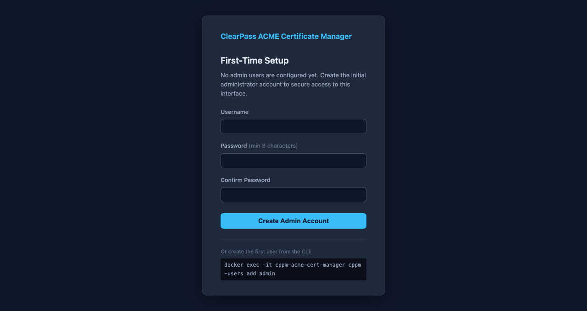
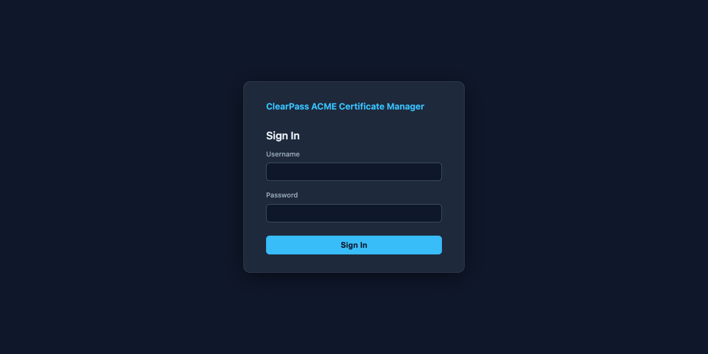
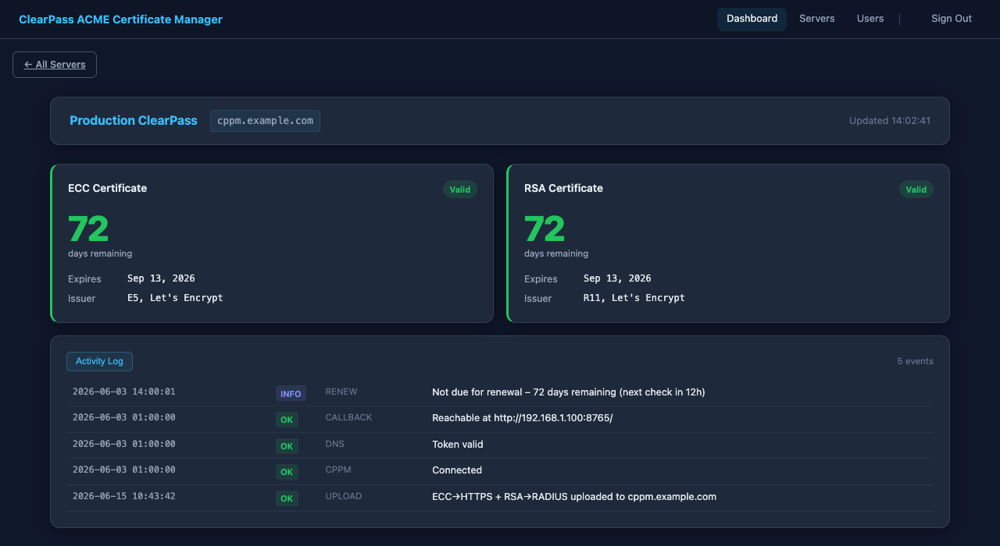
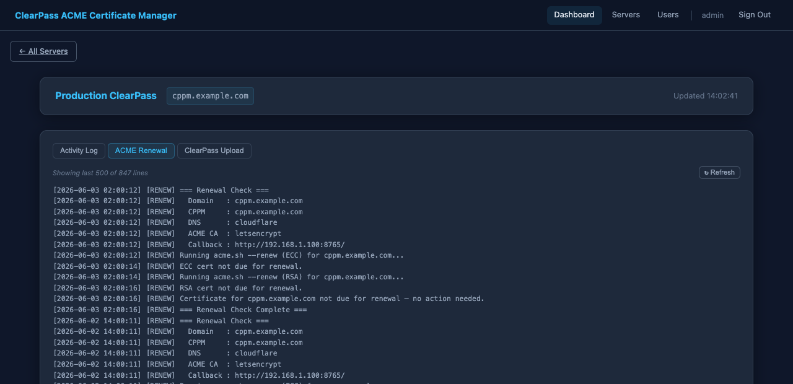
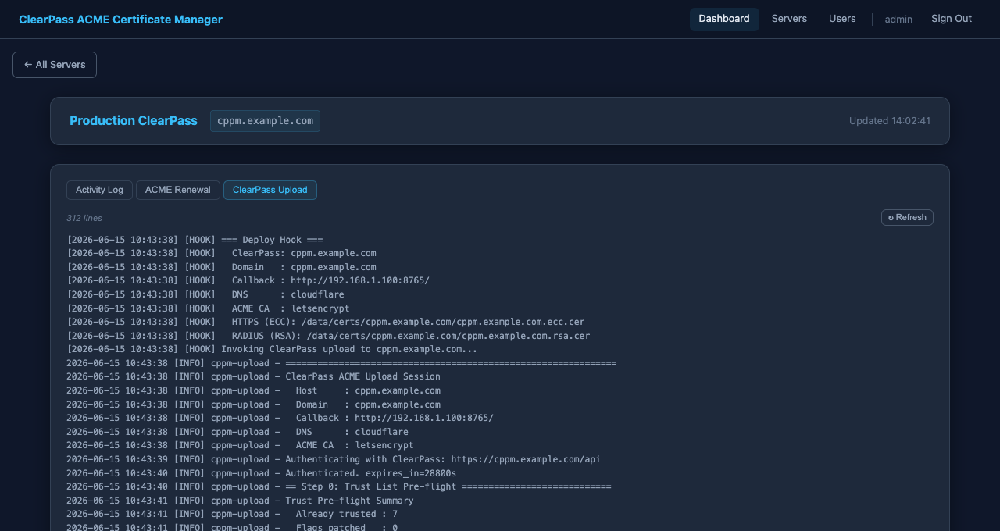
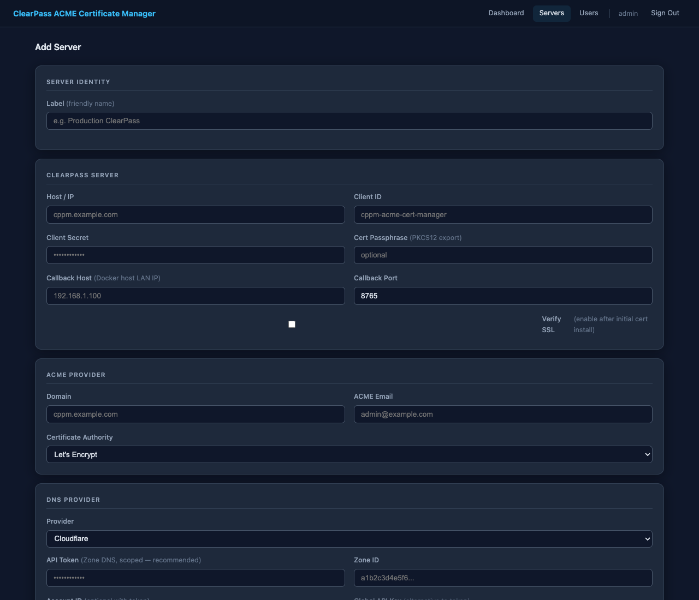
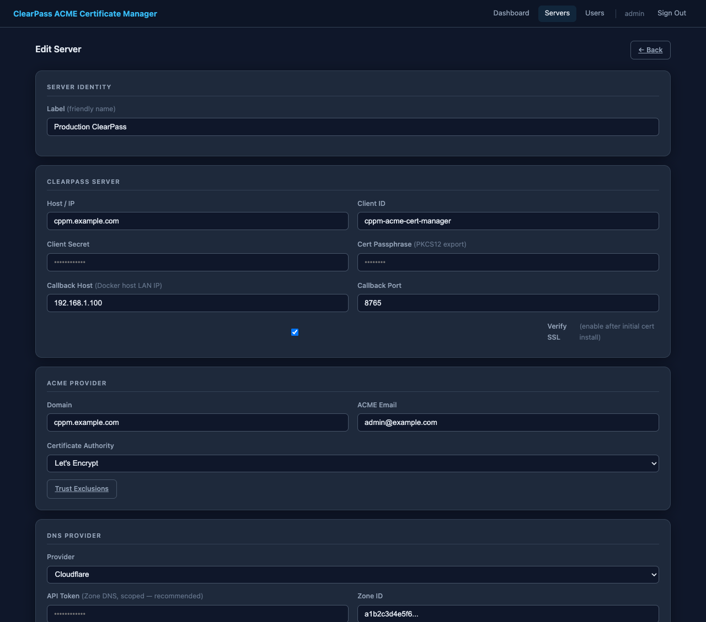
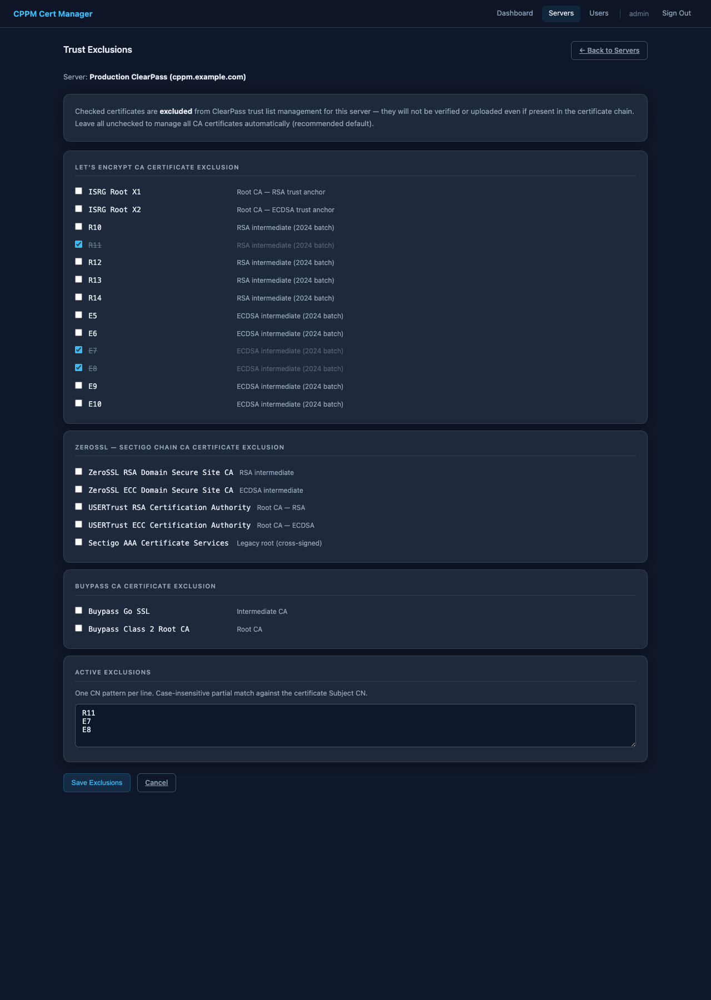
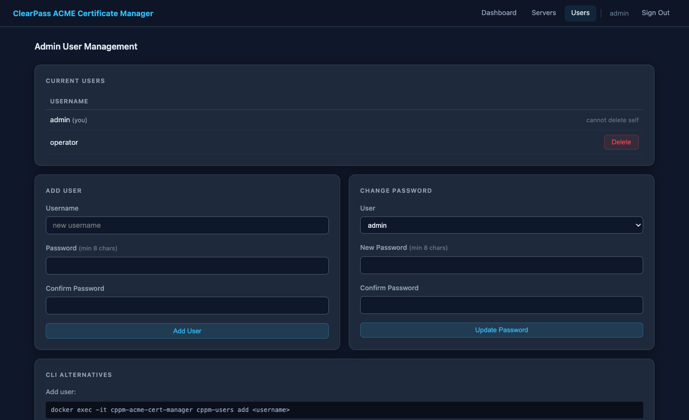

# Monitoring

## Web UI overview

The built-in web interface starts automatically with the container. It provides
a multi-server dashboard, per-server certificate details, service configuration,
trust exclusion management, and admin user management — all accessible from a browser.

Open in a browser:

```
http://<docker-host>:8080/
```

> Change the port by setting `STATUS_PORT` in `.env` (default `8080`).

### Navigation

| Link | Route | Requires sign-in |
|---|---|---|
| **Dashboard** | `/` | No (public by default) |
| **Servers** | `/settings` | Yes |
| **Users** | `/admin/users` | Yes |
| **Sign Out** | `/logout` | — |

Set `REQUIRE_AUTH_FOR_STATUS=true` in `.env` to require sign-in for the
Dashboard as well. The Servers and Users pages always require authentication.

---

## First-time setup

On first access, no admin accounts exist. The navigation bar shows a **Setup**
link. Click it — or navigate directly to `/setup` — to create the initial
administrator account.



**Requirements:** username (letters, digits, `-`, `_`, 1–64 chars) and a
password of at least 8 characters.

After the account is created you are redirected to the sign-in page.

### CLI alternative

```bash
docker exec -it cppm-acme-cert-manager cppm-users add admin
```

---

## Authentication



| Behavior | Detail |
|---|---|
| **Session lifetime** | 8 hours (configurable via `SESSION_LIFETIME_HOURS` env var) |
| **Credential storage** | bcrypt-hashed in `/opt/cppm-certs/admin.htpasswd` (persists across rebuilds) |
| **Session token** | HMAC-SHA256 signed cookie; secret in `/opt/cppm-certs/.session-secret` |
| **Public dashboard** | By default the certificate status page is readable without login |
| **Require auth** | Set `REQUIRE_AUTH_FOR_STATUS=true` in `.env` to protect the dashboard |

---

## Main dashboard — multi-server overview

The main page (`/`) shows a table with one row per configured ClearPass server.

| Column | What you see |
|---|---|
| **ClearPass Server** | Friendly label and host address |
| **DNS & ACME Provider** | DNS provider name with the ACME certificate authority listed below |
| **ECC Certificate** | Days remaining (colour-coded), expiry date, service label (HTTPS · Web Interface) |
| **RSA Certificate** | Days remaining (colour-coded), expiry date, service label (RADIUS · 802.1X) |
| **Next Renewal Check** | Countdown until the next scheduled renewal check and the cron schedule |
| *(Details button)* | Opens the per-server detail view |

Certificate day counts are colour-coded:

| Colour | Meaning |
|---|---|
| **Green** | More than 30 days remaining |
| **Amber** | 15–30 days remaining |
| **Red** | Fewer than 15 days remaining |

The table refreshes automatically every 30 seconds. If no servers have been
configured yet the table shows a link to add the first one.

Click any row or the **Details →** button to open the per-server detail view.


---

## Per-server detail view

Navigate to a server's detail page by clicking **Details →** on the main
dashboard, or directly via `/server/<id>`.


### Panels

| Panel | What you see |
|---|---|
| **ECC Certificate** | Days remaining, expiry and issue dates, issuer CN, key type and size, SAN list |
| **RSA Certificate** | Same fields for the RSA certificate |
| **Renewal Schedule** | Countdown to the next `renew.sh` run (02:00 or 14:00 container-local time) |
| **Configuration** | Domain, DNS provider (with status dot), ACME CA, ClearPass host (with status dot), callback URL (with status dot) |
| **Logs** | Tabbed log viewer — see below |

### Log viewer tabs

The log section at the bottom of the server detail page provides three tabs:


| Tab | Log file | Who can view |
|---|---|---|
| **Activity Log** | `<server>/status.log` | Everyone (no sign-in required) |
| **ACME Renewal** | `<server>/.logs/acme_renewal.log` | Signed-in users only |
| **ClearPass Upload** | `<server>/.logs/cppm_upload.log` | Signed-in users only |

Non-authenticated users see only the Activity Log tab:



**Activity Log** — one line per event, newest first, colour-coded by level (`OK` green, `WARN` yellow, `FAILED` red, `INFO` grey). Covers cert issuance/renewal, ClearPass upload outcomes, and health check state changes (CPPM, DNS, Callback).

**ACME Renewal** — full `acme.sh` output from certificate issuance and renewal runs. Each session opens with a header showing Domain, ClearPass host, DNS provider, ACME CA, and callback URL.



**ClearPass Upload** — complete ClearPass REST API upload log, including OAuth token exchange, trust list pre-flight, PKCS12 serving, HTTPS(ECC) and RADIUS(RSA) cert upload steps, and verification.



Each raw-log tab loads lazily (fetched only when first clicked) and includes a **↻ Refresh** button to reload without switching tabs.

### Certificate details modal

Click **View Details** on either certificate card to see the full decoded
certificate: subject CN, SANs, issuer, serial number, key algorithm and size,
validity window, and the raw PEM with a **Copy** button. Press **Escape** or
click outside the modal to close it.

### Service connectivity status lights

The Configuration card shows a real-time connectivity indicator next to the
DNS provider and ClearPass host:

| Colour | Meaning |
|---|---|
| **Green** | Reachable and credentials valid |
| **Yellow** | Reachable but authentication issue |
| **Red** | Unreachable or timeout |
| **Gray (pulsing)** | Check in progress |
| **Gray (solid)** | Not configured or provider check not available |

The check runs on page load and repeats every 5 minutes. Hover over a dot to
see the specific status message. Results are cached server-side for 2 minutes.

**ClearPass check** — attempts an OAuth `client_credentials` exchange against
`/api/oauth`. A green dot confirms the host is reachable and the API client
credentials are valid.

**DNS provider checks** — provider-specific:

| Provider | Check |
|---|---|
| Cloudflare | `GET /client/v4/user/tokens/verify` (scoped token) or `/user` (global key) |
| Porkbun | `POST /api/json/v3/ping` with API key |
| DigitalOcean | `GET /v2/account` with token |
| GoDaddy | `GET /v1/domains` with key:secret |
| Route 53 | TCP reachability to `route53.amazonaws.com` |

---

## Servers page — ClearPass server configuration

The Servers page (`/settings`) manages the list of ClearPass servers and their
ACME and DNS provider configurations. Sign-in is required.

Navigate to **Servers** in the top navigation bar.


### Server list actions

Each server row shows two action buttons:

| Button | Action |
|---|---|
| **Edit** | Modify server credentials, DNS provider, ACME settings, and trust exclusions |
| **Delete** | Remove the server entry (inline two-step confirmation) |

### Adding a server

Click **+ Add Server** and fill in all fields.



| Section | Fields |
|---|---|
| **Identity** | Friendly label |
| **ClearPass** | Host/IP, Client ID, Client Secret, Cert Passphrase, Callback Host/Port, Verify SSL |
| **ACME Provider** | Domain, ACME email address, Certificate Authority (Let's Encrypt / Staging / ZeroSSL / Buypass) |
| **DNS Provider** | Provider selector; credential fields update dynamically for the selected provider |

#### DNS provider credential fields

| Provider | Fields |
|---|---|
| Cloudflare | API Token + Zone ID (recommended), or Global API Key + Email |
| Porkbun | API Key + Secret API Key |
| AWS Route 53 | Access Key ID + Secret Access Key + Region |
| DigitalOcean | API Token |
| GoDaddy | API Key + API Secret |

Only the credential fields for the active provider are submitted — all others
are disabled in the browser before the form is sent.

### Editing and deleting

Click **Edit** on any row to open the edit form.



The edit form adds a **Trust Exclusions** button in the **ACME Provider** section,
which links to the per-server trust exclusion configuration page. This button is
not shown on the Add Server form.

- Click **Delete** to start an inline two-step confirmation — no browser popup.

Each ClearPass host must be unique across all server entries. Attempts to save
a duplicate host are rejected with an error message.

Server configurations are stored in `/opt/cppm-certs/servers.json` (container
path `/data/certs/servers.json`, chmod 600) and persist across container rebuilds.

### CLI alternative

All server operations are available without a browser:

```bash
# List all configured servers (shows IDs needed for other commands)
docker exec -it cppm-acme-cert-manager cppm-servers list

# Add a new server (interactive prompts)
docker exec -it cppm-acme-cert-manager cppm-servers add

# Show full configuration for a server
docker exec -it cppm-acme-cert-manager cppm-servers show <id>

# Edit an existing server
docker exec -it cppm-acme-cert-manager cppm-servers edit <id>

# Delete a server
docker exec -it cppm-acme-cert-manager cppm-servers delete <id>
```

Secret values (client secret, cert passphrase, DNS credentials) are never
echoed during input. The `show` command displays `(set)` or `(empty)` in place
of secret field values.

---

## Trust Exclusions — per-server CA certificate management

Each ClearPass server has its own trust exclusion configuration. Excluded CA
certificates are not verified or uploaded to the ClearPass trust list for that
server, even if they are present in the certificate chain.

**By default no certificates are excluded** — the tool manages all CA and
intermediate CA certificates automatically.

### Accessing trust exclusions

From the Servers page click **Edit** on the server you want to configure, then
click **Trust Exclusions** in the **ACME Provider** section of the edit form.



### Configuring exclusions

The page shows only the CA certificates relevant to the ACME provider configured
for that server:

| ACME Provider | Section shown |
|---|---|
| Let's Encrypt / Let's Encrypt Staging | **Let's Encrypt CA Certificate Exclusion** — ISRG Root X1/X2, R10–R14, E5–E10 |
| ZeroSSL | **ZeroSSL — Sectigo Chain CA Certificate Exclusion** — ZeroSSL RSA/ECC intermediates, USERTrust roots, Sectigo AAA |
| Buypass | **Buypass CA Certificate Exclusion** — Buypass Go SSL, Buypass Class 2 Root CA |

Check a box to exclude that certificate. The label text strikes through to
confirm the selection. Unchecking re-enables management for that certificate.

The **Active Exclusions** textarea at the bottom shows exactly what will be
saved — one CN pattern per line. You can edit it directly for custom patterns
not in the preset list. Partial CN matching is supported:
`ISRG Root` matches both `ISRG Root X1` and `ISRG Root X2`.

Exclusions take effect at the next scheduled or manual trust check.

### Global fallback file

A global `trust-exclusions.conf` file on the persistent volume applies to any
server that has **no per-server exclusions configured**:

```
/opt/cppm-certs/trust-exclusions.conf   (host path)
/data/certs/trust-exclusions.conf       (container path)
```

**Priority:** per-server exclusions (from `servers.json`) always take
precedence. The file is only consulted when a server's `trust_exclusions` list
is empty. This means existing installations with a `trust-exclusions.conf` file
continue to work without any migration — configure per-server exclusions
through the web UI when you are ready to move to per-server control.

---

## Admin user management

Navigate to **Users** in the top navigation bar (sign-in required).



| Action | How |
|---|---|
| **Add user** | Fill in the Add User form |
| **Change password** | Select a user in the Change Password form |
| **Delete user** | Click Delete on the user row → confirm inline |

You cannot delete your own account while signed in. If the last user is deleted
the setup wizard becomes available again on the next page load.

### CLI alternative

```bash
# Add a user
docker exec -it cppm-acme-cert-manager cppm-users add <username>

# Change a password
docker exec -it cppm-acme-cert-manager cppm-users passwd <username>

# Delete a user
docker exec -it cppm-acme-cert-manager cppm-users delete <username>

# List all users
docker exec -it cppm-acme-cert-manager cppm-users list
```

Passwords must be at least 8 characters.

### Web service log

```bash
# Startup confirmation, HTTP request log, and any errors
tail -50 /opt/cppm-certs/.logs/status_server.log
```

---

## status.log — per-server activity log

Each ClearPass server has its own `status.log` at:

```
/opt/cppm-certs/<cppm_host>/status.log    ← host path
/data/certs/<cppm_host>/status.log        ← container path
```

It records one line per significant event in a fixed column format and is what
the web UI's **Activity Log** tab reads. It is publicly readable (no sign-in
required):

```
TIMESTAMP           | LEVEL  | CATEGORY | MESSAGE
2026-06-15 10:43:00 | INFO   | CERT     | No certificates found – starting first-time issuance
2026-06-15 10:43:34 | OK     | CERT     | New certificates issued (ECC + RSA) via cloudflare DNS-01
2026-06-15 10:43:38 | OK     | TRUST    | 7 CA certs verified – 2 uploaded, 5 already trusted
2026-06-15 10:43:42 | OK     | UPLOAD   | ECC→HTTPS + RSA→RADIUS uploaded to cppm.example.com
2026-06-03 01:00:00 | OK     | CPPM     | Connected
2026-06-03 01:00:00 | OK     | DNS      | Token valid
2026-06-03 01:00:00 | OK     | CALLBACK | Reachable at http://192.168.1.100:8765/
2026-06-03 02:00:01 | INFO   | RENEW    | Not due for renewal – 72 days remaining (next check in 12h)
```

```bash
# View on the host (replace cppm.example.com with your ClearPass hostname)
cat /opt/cppm-certs/cppm.example.com/status.log

# Live tail
tail -f /opt/cppm-certs/cppm.example.com/status.log

# Show only failures
grep FAILED /opt/cppm-certs/cppm.example.com/status.log

# Show only upload events
grep UPLOAD /opt/cppm-certs/cppm.example.com/status.log
```

A global `status.log` at `/opt/cppm-certs/status.log` records container-level
startup and shutdown events only (not per-server cert or upload activity).

---

## Log levels

| Level | Meaning |
|---|---|
| `OK` | Task completed successfully |
| `INFO` | Informational — no action required |
| `WARN` | Something unexpected but recoverable |
| `FAILED` | Task failed — check the detailed log for the corresponding category |

## Categories

| Category | Written to | Written by | Covers |
|---|---|---|---|
| `STARTUP` | Global `status.log` | `entrypoint.sh` | Container start, supercronic launch |
| `CERT` | Per-server `status.log` | `entrypoint.sh`, `issue_cert.sh`, `install_cert.sh` | Issuance, install-cert, expiry status |
| `RENEW` | Per-server `status.log` | `renew.sh` | Daily renewal check results |
| `TRUST` | Per-server `status.log` | `clearpass_upload.py`, `trust_check.sh` | CA trust list pre-flight and weekly check |
| `UPLOAD` | Per-server `status.log` | `deploy_hook.sh`, `clearpass_upload.py` | ClearPass API upload results |
| `CPPM` | Per-server `status.log` | `status_server.py` | ClearPass API connectivity state changes |
| `DNS` | Per-server `status.log` | `status_server.py` | DNS provider credential state changes |
| `CALLBACK` | Per-server `status.log` | `status_server.py` | Callback HTTP service reachability changes |

`CPPM`, `DNS`, and `CALLBACK` entries are written only when the status **changes** (e.g., green → red, or red → green), so they mark incidents and recoveries rather than every periodic check.

---

## Expected status.log patterns

### Normal restart (both certs already installed)

```
2026-03-18 09:00:01 | INFO   | STARTUP | Container started
2026-03-18 09:00:02 | OK     | CERT    | ECC+RSA valid – expires Jun 15 2026 (88 days remaining)
2026-03-18 09:00:02 | INFO   | STARTUP | supercronic started – renewal checks at 02:00 and 14:00 UTC
```

### Daily renewal check (not yet due)

```
2026-03-19 02:00:01 | INFO   | RENEW   | Not due for renewal – 87 days remaining (next check in 12h)
```

### Successful renewal (~day 60)

```
2026-06-01 02:00:01 | OK     | RENEW   | Certificates renewed – running install and upload
2026-06-01 02:00:08 | OK     | CERT    | ECC+RSA certs installed – expires Sep 13 2026 (89 days remaining)
2026-06-01 02:00:11 | OK     | TRUST   | 7 CA certs verified – 0 uploaded, 7 already trusted
2026-06-01 02:00:15 | OK     | UPLOAD  | ECC→HTTPS + RSA→RADIUS uploaded to cppm.example.com
```

### Weekly trust list check (no action needed)

```
2026-06-08 03:00:07 | OK     | TRUST   | 9 CA certs verified – 0 uploaded, 0 patched, 9 already trusted
```

---

## Detailed logs

Per-server logs are in `/opt/cppm-certs/<cppm_host>/.logs/`:

```bash
# acme.sh issuance and renewal full output (per server)
tail -100 /opt/cppm-certs/cppm.example.com/.logs/acme_renewal.log

# ClearPass API upload full output (per server)
tail -100 /opt/cppm-certs/cppm.example.com/.logs/cppm_upload.log
```

Container-level logs are in `/opt/cppm-certs/.logs/`:

```bash
# Container startup and cert state decisions
tail -100 /opt/cppm-certs/.logs/startup.log

# Web dashboard startup and request log
tail -50 /opt/cppm-certs/.logs/status_server.log
```

These same logs are also accessible in the web UI on the server detail page —
**ACME Renewal** and **ClearPass Upload** tabs (sign-in required).

---

## Docker container logs

```bash
# Live
docker compose logs -f

# Last 100 lines
docker compose logs --tail=100

# Since a specific time
docker compose logs --since="2026-03-17T10:00:00"
```

---

## Verify the certificates directly

```bash
# Check expiry of the installed ECC cert (replace hostname as needed)
openssl x509 -in /opt/cppm-certs/cppm.example.com/cppm.example.com.ecc.cer -noout -subject -dates

# Check expiry of the installed RSA cert
openssl x509 -in /opt/cppm-certs/cppm.example.com/cppm.example.com.rsa.cer -noout -subject -dates

# Verify what CPPM is actually serving over HTTPS
openssl s_client -connect cppm.example.com:443 \
    -servername cppm.example.com </dev/null 2>/dev/null \
    | openssl x509 -noout -subject -issuer -dates
```
