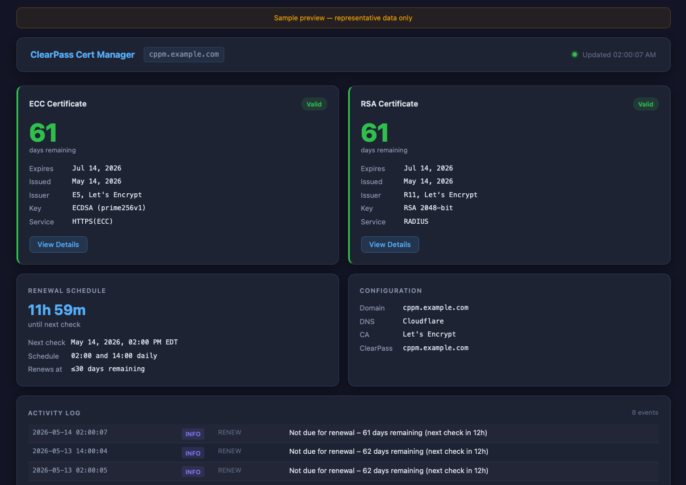

# Monitoring

## Web status dashboard

The built-in web dashboard starts automatically with the container and provides
a real-time view of certificate health, service connectivity, renewal schedule,
and the activity log.



Open in a browser:

```
http://<docker-host>:8080/
```

> Change the port by setting `STATUS_PORT` in `.env` (default `8080`).

---

## First-time setup wizard

On first access, no admin accounts exist. The dashboard shows a **Setup** link
in the navigation bar. Click it — or navigate directly to `/setup` — to create
the initial administrator account.

**Requirements:** username (letters, digits, `-`, `_`, 1–64 chars) and a
password of at least 8 characters.

After the account is created you are redirected to the sign-in page. Use the
same credentials to log in.

### CLI alternative

If you prefer to create the first account without a browser:

```bash
docker exec -it cppm-acme-cert-manager cppm-users add admin
```

---

## Authentication

| Behavior | Detail |
|---|---|
| **Session lifetime** | 8 hours (configurable via `SESSION_LIFETIME_HOURS` env var) |
| **Credential storage** | bcrypt-hashed in `/opt/cppm-certs/admin.htpasswd` (persists across rebuilds) |
| **Session token** | HMAC-SHA256 signed cookie; secret in `/opt/cppm-certs/.session-secret` |
| **Public dashboard** | By default the certificate status page is readable without login |
| **Require auth** | Set `REQUIRE_AUTH_FOR_STATUS=true` in `.env` to protect the status page |

The `/admin/*` routes and the Servers page always require an authenticated session,
regardless of `REQUIRE_AUTH_FOR_STATUS`.

---

## Dashboard panels

| Panel | What you see |
|---|---|
| **ECC Certificate** | Days remaining (green/amber/red), expiry and issue dates, issuer CN, key type |
| **RSA Certificate** | Same fields for the RSA cert |
| **Renewal Schedule** | Countdown to the next `renew.sh` run (02:00 or 14:00 container-local time) |
| **Configuration** | Active domain, DNS provider (with status light), ACME CA, ClearPass hostname (with status light) |
| **Activity Log** | Last 40 `status.log` events, newest first, colour-coded by level |

### Service status lights

The per-server **Details** page shows a real-time connectivity indicator next
to the DNS provider and ClearPass host in the Configuration card:

| Colour | Meaning |
|---|---|
| **Green** | Reachable and credentials valid |
| **Yellow** | Reachable but authentication issue |
| **Red** | Unreachable or timeout |
| **Gray (pulsing)** | Check in progress |
| **Gray (solid)** | Not configured or provider check not available |

The check runs automatically on page load and repeats every 5 minutes. Hover
over a dot to see the specific status message. Results are cached server-side
for 2 minutes so the dashboard never hammers external APIs.

**ClearPass check** — attempts a full OAuth `client_credentials` exchange
against `/api/oauth`. A green dot confirms the host is reachable and the
API client credentials are correct.

**DNS provider checks** — provider-specific:

| Provider | Check |
|---|---|
| Cloudflare | `GET /client/v4/user/tokens/verify` (scoped token) or `/user` (global key) |
| Porkbun | `POST /api/json/v3/ping` with API key |
| DigitalOcean | `GET /v2/account` with token |
| GoDaddy | `GET /v1/domains` with key:secret |
| Route 53 | TCP reachability to `route53.amazonaws.com` |

### Certificate Details modal

Click **View Details** on either cert card to see the full decoded certificate:
subject CN, SANs, issuer, serial number, key algorithm and size, validity
window, and the raw PEM with a **Copy** button. Press **Escape** or click
outside the modal to close it.

The page polls `/api/status` every 30 seconds and updates in place. It has
no external dependencies and works in air-gapped environments.

---

## Servers page

The Servers page (authenticated users only) manages the list of ClearPass
servers and their associated ACME and DNS configurations.

Navigate to **Servers** in the top navigation bar.

### Adding a server

Click **+ Add Server**. Fill in all fields for the new server entry.

Each server entry includes:

| Section | Fields |
|---|---|
| **Identity** | Friendly label |
| **ClearPass** | Host/IP, Client ID, Client Secret, Cert Passphrase, Callback Host/Port, Verify SSL checkbox |
| **Domain & ACME** | Domain, ACME email, Certificate Authority (Let's Encrypt / Staging / ZeroSSL / Buypass) |
| **DNS Provider** | Provider selector; credential fields update dynamically based on the selected provider |

### DNS provider credential fields

| Provider | Fields shown |
|---|---|
| Cloudflare | API Token + Zone ID (recommended), or Global Key + Email |
| Porkbun | API Key + Secret API Key |
| AWS Route 53 | Access Key ID + Secret Access Key + Region |
| DigitalOcean | API Token |
| GoDaddy | API Key + API Secret |

Only the credential fields for the selected provider are submitted — fields for
other providers are disabled in the browser before form submission.

### Editing and deleting

- Click **Edit** on any row to modify an existing server entry.
- Click **Delete** to initiate an inline two-step confirmation (no browser popup).

Server configurations are stored in `/opt/cppm-certs/servers.json` (container
path `/data/certs/servers.json`), which is chmod 600 and persists across
container rebuilds alongside the certificates.

---

### CLI server management

All server operations are also available via the CLI without a browser:

```bash
# List all configured servers (shows IDs needed for other commands)
docker exec -it cppm-acme-cert-manager cppm-servers list

# Add a new server (interactive prompts)
docker exec -it cppm-acme-cert-manager cppm-servers add

# Show full configuration for a server
docker exec -it cppm-acme-cert-manager cppm-servers show <id>

# Edit an existing server
docker exec -it cppm-acme-cert-manager cppm-servers edit <id>

# Delete a server
docker exec -it cppm-acme-cert-manager cppm-servers delete <id>
```

Secret values (client secret, cert passphrase, DNS credentials) are never
echoed during input. The `show` command displays `(set)` or `(empty)` in place
of secret field values.

---

## Admin user management

Navigate to **Users** in the top navigation bar (sign-in required).

| Action | How |
|---|---|
| **Add user** | Fill in the Add User form on the left |
| **Change password** | Select a user from the dropdown in the Change Password form |
| **Delete user** | Click Delete on the user row → confirm inline |

You cannot delete your own account while signed in.

### CLI user management

All user operations are also available via the CLI:

```bash
# Add a user
docker exec -it cppm-acme-cert-manager cppm-users add <username>

# Change a password
docker exec -it cppm-acme-cert-manager cppm-users passwd <username>

# Delete a user
docker exec -it cppm-acme-cert-manager cppm-users delete <username>

# List all users
docker exec -it cppm-acme-cert-manager cppm-users list
```

Passwords must be at least 8 characters. If the last user is deleted the
setup wizard becomes available again on the next page load.

### Dashboard server log

```bash
# Startup confirmation, HTTP request log, and any errors
tail -50 /opt/cppm-certs/.logs/status_server.log
```

---

## status.log — the quick view

`status.log` lives directly in `/opt/cppm-certs/` and is readable on the host
without `docker exec`. It records one line per significant event using a fixed
column format:

```
TIMESTAMP           | LEVEL  | CATEGORY | MESSAGE
2026-03-17 10:43:07 | INFO   | STARTUP  | Container started – domain=cppm.example.com
2026-03-17 10:43:07 | INFO   | CERT     | No certificates found – starting first-time issuance
2026-03-17 10:43:34 | OK     | CERT     | New certificates issued (ECC + RSA) via cloudflare DNS-01
2026-03-17 10:43:34 | OK     | CERT     | ECC+RSA certs installed – expires Jun 15 2026 (89 days remaining)
2026-03-17 10:43:38 | OK     | TRUST    | 7 LE CA certs verified – 2 uploaded, 5 already trusted
2026-03-17 10:43:42 | OK     | UPLOAD   | ECC→HTTPS + RSA→RADIUS uploaded to cppm.example.com
2026-03-17 10:43:42 | INFO   | STARTUP  | supercronic started – renewal checks at 02:00 and 14:00 UTC
```

```bash
# View on the host
cat /opt/cppm-certs/status.log

# Live tail
tail -f /opt/cppm-certs/status.log

# Show only failures
grep FAILED /opt/cppm-certs/status.log

# Show only upload events
grep UPLOAD /opt/cppm-certs/status.log

# Show last 10 events
tail -10 /opt/cppm-certs/status.log
```

---

## Log levels

| Level | Meaning |
|---|---|
| `OK` | Task completed successfully |
| `INFO` | Informational — no action required |
| `WARN` | Something unexpected but recoverable (e.g. trust cert flags needed patching) |
| `FAILED` | Task failed — check the detailed log for the corresponding category |

## Categories

| Category | Written by | Covers |
|---|---|---|
| `STARTUP` | `entrypoint.sh` | Container start, supercronic launch, env validation |
| `CERT` | `entrypoint.sh`, `issue_cert.sh`, `install_cert.sh` | Issuance, install-cert, expiry status |
| `RENEW` | `renew.sh` | Daily renewal check results |
| `TRUST` | `clearpass_upload.py`, `trust_check.sh` | Let's Encrypt trust list pre-flight and weekly check |
| `UPLOAD` | `deploy_hook.sh`, `clearpass_upload.py` | ClearPass API upload results |

---

## Expected status.log patterns

### Normal restart (both certs already installed)

```
2026-03-18 09:00:01 | INFO   | STARTUP | Container started – domain=cppm.example.com
2026-03-18 09:00:02 | OK     | CERT    | ECC+RSA valid – expires Jun 15 2026 (88 days remaining)
2026-03-18 09:00:02 | INFO   | STARTUP | supercronic started – renewal checks at 02:00 and 14:00 UTC
```

### Daily renewal check (not yet due)

```
2026-03-19 02:00:01 | INFO   | RENEW   | Not due for renewal – 87 days remaining (next check in 12h)
```

### Successful renewal (~day 60)

```
2026-06-01 02:00:01 | OK     | RENEW   | Certificates renewed – running install and upload
2026-06-01 02:00:08 | OK     | CERT    | ECC+RSA certs installed – expires Sep 13 2026 (89 days remaining)
2026-06-01 02:00:11 | OK     | TRUST   | 7 LE CA certs verified – 0 uploaded, 7 already trusted
2026-06-01 02:00:15 | OK     | UPLOAD  | ECC→HTTPS + RSA→RADIUS uploaded to cppm.example.com
```

### Weekly trust list check (no renewal needed)

```
2026-06-08 03:00:02 | INFO   | TRUST   | Periodic trust list check started
2026-06-08 03:00:07 | OK     | TRUST   | 9 LE CA certs verified – 0 uploaded, 0 patched, 9 already trusted
```

### Weekly trust list check (missing cert uploaded)

```
2026-06-08 03:00:02 | INFO   | TRUST   | Periodic trust list check started
2026-06-08 03:00:09 | OK     | TRUST   | 9 LE CA certs verified – 1 uploaded, 0 patched, 8 already trusted
```

### Upload failure

```
2026-06-01 02:00:15 | FAILED | UPLOAD  | ClearPass upload failed (exit 1) – check upload.log
```

---

## Detailed logs

The `.logs/` directory contains verbose output for deeper investigation:

```bash
# Container startup and cert state decisions
tail -100 /opt/cppm-certs/.logs/startup.log

# acme.sh issuance and renewal full output (includes DNS provider API calls)
tail -100 /opt/cppm-certs/.logs/renewal.log

# ClearPass API upload detail (OAuth, PKCS12, API responses)
tail -100 /opt/cppm-certs/.logs/upload.log

# supercronic execution timestamps
tail -50 /opt/cppm-certs/.logs/cron.log

# Web dashboard startup, HTTP request log, and errors
tail -50 /opt/cppm-certs/.logs/status_server.log
```

---

## Docker container logs

```bash
# Live
docker compose logs -f

# Last 100 lines
docker compose logs --tail=100

# Since a specific time
docker compose logs --since="2026-03-17T10:00:00"
```

---

## Verify the certificates directly

```bash
# Check expiry of the installed ECC cert
openssl x509 -in /opt/cppm-certs/cppm.example.com.ecc.cer -noout -subject -dates

# Check expiry of the installed RSA cert
openssl x509 -in /opt/cppm-certs/cppm.example.com.rsa.cer -noout -subject -dates

# Verify what CPPM is actually serving over HTTPS
openssl s_client -connect cppm.example.com:443 \
    -servername cppm.example.com </dev/null 2>/dev/null \
    | openssl x509 -noout -subject -issuer -dates
```

---

## Check which DNS provider is active

```bash
docker exec -it cppm-acme-cert-manager sh -c 'echo "DNS_PROVIDER=${DNS_PROVIDER}"'
```

The renewal log also records the active provider on each issuance:

```
[ISSUE] Domain: cppm.example.com
[ISSUE] Provider: porkbun
[ISSUE] Server:   letsencrypt
```
