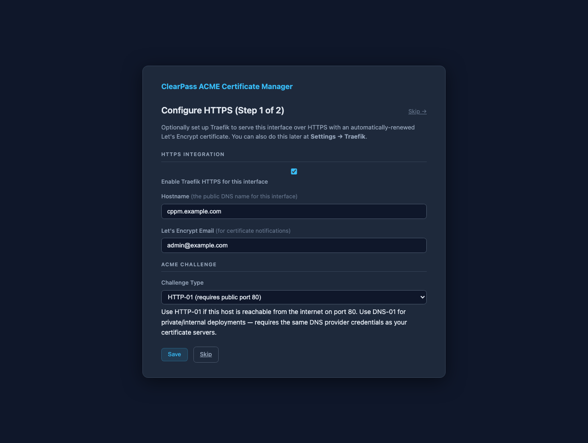
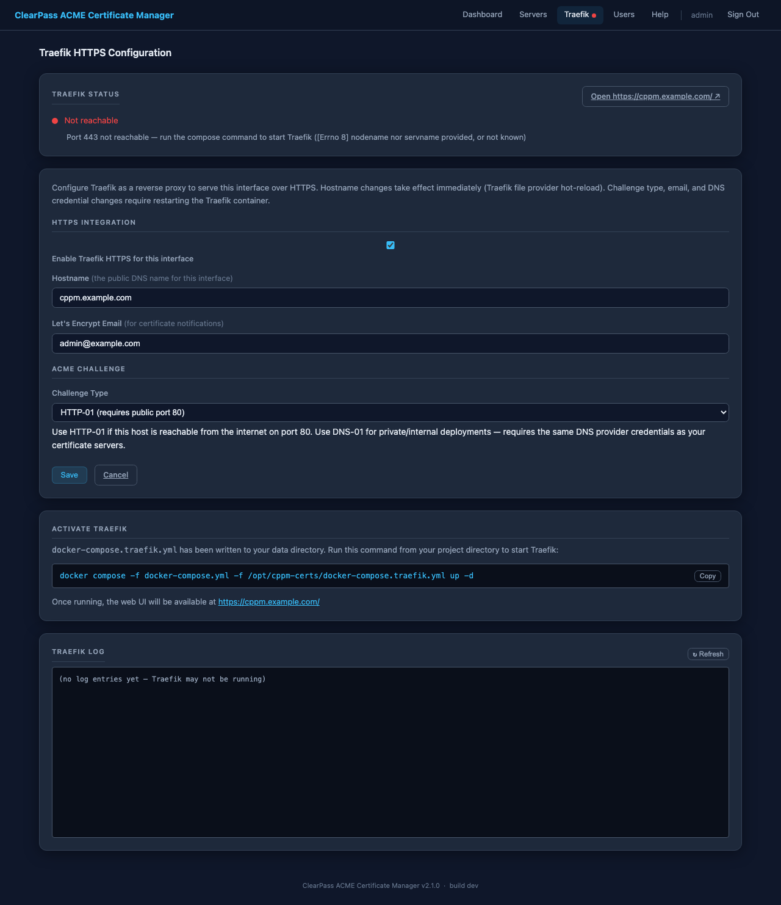

# HTTPS with Traefik

The web UI runs on HTTP by default. Add Traefik as a reverse proxy to serve
the web UI over HTTPS with an automatically-renewed Let's Encrypt certificate.

---

## Quick start

**1. Configure in the web UI** — open the setup wizard or navigate to
**Settings → Traefik**, fill in your hostname, contact email, and challenge
type, then click **Save**. The web UI writes the compose overlay and creates
all required directories automatically.

**2. Start Traefik** (one command, from your project directory):

```bash
docker compose -f docker-compose.yml -f /opt/cppm-certs/docker-compose.traefik.yml up -d
```

The web UI is then available at `https://<your-hostname>/`. HTTP (port 80)
redirects automatically to HTTPS. Port 8080 remains accessible for local
access or debugging.

> **Note:** The PKCS12 callback port (8765) is not routed through Traefik.
> ClearPass connects to it directly over HTTP — this is expected and required.

---

## Challenge types

### HTTP-01 (default)

Let's Encrypt sends an HTTP request to port 80 on your domain to verify
ownership. Requires the host to be publicly reachable from the internet on
port 80. No additional credentials are needed.

### DNS-01

Let's Encrypt verifies ownership by checking a `_acme-challenge` TXT record
in your DNS zone. Works on internal or air-gapped networks where port 80 is
not reachable from the internet.

Uses the same DNS provider credentials you already saved for certificate
issuance — select your provider in the Traefik settings page and the
credentials are pre-populated automatically.

Traefik uses [Lego](https://go-acme.github.io/lego/dns/) for DNS-01
challenges with slightly different variable names from this project's ACME
configuration. The web UI translates them automatically when writing the
compose file:

| DNS Provider | Traefik / Lego env vars |
|---|---|
| **Cloudflare** | `CF_DNS_API_TOKEN` (from `CF_Token`) |
| **Porkbun** | `PORKBUN_API_KEY`, `PORKBUN_SECRET_API_KEY` |
| **AWS Route 53** | `AWS_ACCESS_KEY_ID`, `AWS_SECRET_ACCESS_KEY`, `AWS_REGION` |
| **DigitalOcean** | `DO_AUTH_TOKEN` (from `DO_API_KEY`) |
| **GoDaddy** | `GODADDY_API_KEY` (from `GD_Key`), `GODADDY_API_SECRET` (from `GD_Secret`) |
| **Infoblox** | `INFOBLOX_USERNAME`, `INFOBLOX_PASSWORD` |
| **RFC 2136** | `RFC2136_NAMESERVER`, `RFC2136_TSIG_KEY`, `RFC2136_TSIG_SECRET` |

---

## Setup workflow

### During initial setup

The setup wizard opens a Traefik configuration step *before* admin account
creation. Fill in your hostname, contact email, and challenge type, then
click **Save**. After running the compose command, follow the link in the UI
to proceed to admin account creation.



### After setup

Navigate to **Settings → Traefik** at any time to configure or update the
integration. The page shows a live status card at the top and a log viewer at
the bottom for troubleshooting.



---

## How routing works

The web UI manages three files in the shared data volume:

| File | Purpose |
|---|---|
| `/opt/cppm-certs/docker-compose.traefik.yml` | Compose overlay — written on every save, deleted when disabled |
| `/opt/cppm-certs/traefik/dynamic/cppm.yml` | Traefik file-provider routing config — hot-reloaded on hostname change |
| `/opt/cppm-certs/traefik/logs/traefik.log` | Traefik process log — readable in the web UI log viewer |

Hostname changes take effect immediately without restarting Traefik (file
provider hot-reload). Changes to the challenge type, email, or DNS credentials
require re-running the compose command to pick up the updated overlay.

The ACME certificate and account key are stored in a Docker-managed named
volume (`traefik_acme`) — created automatically on first run, persists across
container rebuilds.

---

## Monitoring Traefik from the web UI

The **Settings → Traefik** page provides built-in visibility into Traefik's state:

- **Status card** (top of page) — live connectivity probe updated every 15 seconds:
  - 🟢 **Running** — HTTPS active, TLS handshake succeeds
  - 🟡 **Certificate pending** — Traefik is up, ACME issuance still in progress
  - 🔴 **Not reachable** — compose command not yet run, or Traefik stopped
  - **Open `https://<hostname>/` ↗** button appears when Traefik is reachable
- **Nav bar dot** — same three-state indicator visible on every page while Traefik is enabled, updated every 30 seconds
- **Traefik Log** (bottom of page) — last 150 lines of `traefik.log` with a Refresh button; useful for diagnosing ACME failures, DNS challenge errors, and certificate renewal events

---

## Manual setup (Option B)

A template is provided at `docker-compose.traefik.yml` and `.env.traefik.example`.
Edit the file to add your challenge settings and credentials, then copy the
env template:

```bash
cp .env.traefik.example .env
# Edit .env — set TRAEFIK_EMAIL; add DNS credentials if using DNS-01
```

See the inline comments in `docker-compose.traefik.yml` for the full DNS-01
provider block.
